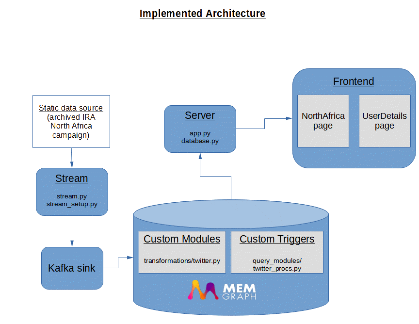

# Memgraph App Challenge - Twitter Disinformation Network Visualizer

<p align="center">
  
</p>

<p align="center">
  <a href="https://github.com/memgraph/memgraph-platform/LICENSE">
    
  </a>
</p>


## The application

As an exploration of the power of graph database technologies for disinformation research, this web application builds a graph out of tweets and visualizes them as 2D and 3D networks. It is inspired in part by the [2016 Russian Twitter Trolls example database for Neo4J](https://github.com/neo4j-graph-examples/twitter-trolls) and is based on the [Memgraph App Challenge starter pack](https://github.com/memgraph/app-challenge-starter-pack) repo. The data in this application comes from a network of 16 Internet Research Agency troll accounts that were engaged in an information operation against the Central African Republic in northern Africa; this network was removed and exposed by Twitter in their [December 2021 Twitter Transparency Center blog post](https://blog.twitter.com/en_us/topics/company/2021/disclosing-state-linked-information-operations-we-ve-removed). For performance reasons, only a small subset of tweets from this network (less than 200) are used.  

The app currently consists of four components:
* **Memgraph**
* **server**
* **stream**
* **frontend**


The app uses the following technologies:
* Memgraph platform
* Memgraph Lab
* Cypher
* Docker
* Docker-Compose
* Python
* Flask v1
* Kafka
* React (including React Hooks)
* Create-React-App
* react-force-graph


## The originally envisioned application architecture


## The final implemented application architecture



## The relational data model


## Starting the app

You can start the entire app by running:
```
docker-compose build
docker-compose up frontend
```

It is currently recommended to run the Docker containers individually in sequence, however. To do so, run the command `docker-compose build`, then run the following commands in different terminals: 
```
docker-compose up server
docker-compose up stream
docker-compose up frontend
```


## Notes for Reviewers

### Data Import
The primary method in this application architecture to load data into the Memgraph database is to stream the data from the preset CSV file to Kafka where it is then imported by Memgraph. However, due to the size of the dataset, this may take a while (est. >10 minutes). A user in a hurry may wish to skip this step and import directly and manually into the database via Memgraph Lab - for these users, an exported `graph.cypherl` DB file with the same data is provided in the `/memgraph/import-data` directory. 

### Unaddressed Bug
On the last day of the contest, after I imported my full (non-test) dataset from all of the included official Twitter csv files as part of my final touch-ups, my backend server and its connection to the Memgraph database started to break upon calls from the client. Part of this problem seemed to do with my backend server calls to Memgraph timing out from the long-running initial query, as there were over 1300 nodes in Memgraph at that time; I attempted to address this issue by upgrading Flask to 2.0.0 and making the `/get-graph` and `/get-graph/properties` endpoint functions asynchronous, but was not successful (and you may find a few `async/await` and `import asyncio` references still in my `app.py` and `database.py` code - if you do, know that these are artefacts from my troubleshooting efforts that I have missed cleaning up). I restored some functionality by paring down the dataset size in `stream/RNA_tweets_hashed_csv` from the full ~20000 to less than 200 for a final set of ~560 nodes in the database, but even after this, the Memgraph connection would be forcibly closed after a few calls from the client and unable to be opened again without a full backend server restart with `docker-compose up server`. The message for this failure in the Docker logs for Memgraph-Mage was `Fatal Python error: deallocating None` with a stack trace that pointed to the networkx/is_weakly_connected library as called from MAGE's graph_analyzer.analyze_subgraph procedure. While writing this, I have restored my code to this broken state in the hopes of retrieving a detailed stack trace for you, but the Docker logs are no longer showing it for reasons I do not know. In any case, adjusting the Cypher query in `database.py` `get_full_graph_properties()` to include fewer analyzers has not helped. 

As such, once you have successfully imported all data into the database through `docker-compose up stream` and have seen the graph with fully rendered statistics on the North Africa page for the first time (similar to the screenshot above), I recommend stopping the entire application, deleting the `<Sidebar />` component on line 248 of `frontend/src/components/pages/NorthAfrica.js` and then running `docker-compose build frontend` and `docker-compose up frontend` again to restart the app. The graph statistics sidebar component is a nice component - I put a non-trivial amount of work into its CSS classes for a good look, and am proud of it. But the API call it is tied to keeps breaking the app's Memgraph database, and you will not be able to easily test the other functionality while it still renders. :( By removing the `<Sidebar>` component from the React DOM tree, you should be free to test the graph filter buttons and the UserDetails page without needing to restart the server. 

### Unfinished Features

- The backend API endpoints `/get-tweet/<id>`, `/get-source/<id>`, and `/get-hashtag/<id>` are dangling endpoints, unused by any frontend code. 
- There are a couple of commented-out attempts to figure out an approach for dynamically filtering the graph in a reusable way within the file `/server/database.py`. I did not get far because I remained stumped on how to design the API for such a feature, as graph data is not exactly a resource where typical RESTful API practices are applicable. 
- The `get_subgraph_properties()` method within `database.py` is unused; my plan was to have this method called every time a filter is applied to the graph, but no API endpoint to utilize it is implemented. 
- Various small loose ends in the frontend styling (container layout, nav menu interactions, etc) that were left incomplete due to time.


## License

This is an open-source project and you are free to use it under the [MIT license](./LICENSE).
